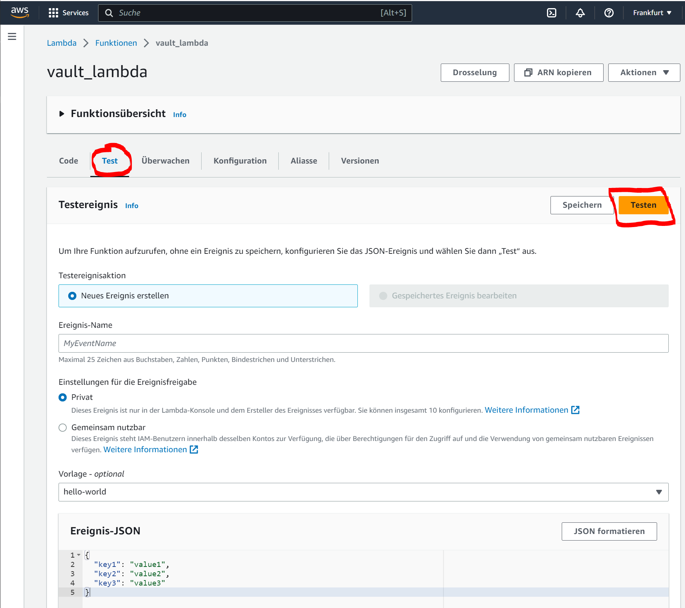

# Example to access Vault from AWS Lambda
This project includes a terraform script which sets up a Lambda function on AWS and the lambda will call Hashicorp Vault to read and wirte a secret. The lambda will authenticate with aws authentication method of vault and all configuration needed on vault side is also done with this terrform script.

## Requirements
* terraform installed and added to path (HowTo: https://developer.hashicorp.com/terraform/tutorials/aws-get-started/install-cli)
* vault up and running
* vault has saved a secret in key value store mounted at /secret
* python incl pip installed (Download: https://www.python.org/downloads/)
* awscli installed (HowTo: https://docs.aws.amazon.com/cli/latest/userguide/getting-started-install.html)
* logged in with awscli, so default credentials exists with Admin Permissions on the AWS Account (HowTo: https://docs.aws.amazon.com/cli/latest/userguide/getting-started-quickstart.html)

## Using the terraform script
Frist of all we need to initialise terraform by calling 
```
terraform init
```

after everything is initialized we can run the plan, nothing will change terraform will only display what would be changed
(you need to put in some variables like secret name to be read from vault, the vault URL and the root token to access vault)
```
terraform plan
```

if the plan look right you can apply the plan by typing (terraform will need some intput and a final approval with 'yes' before changing infrastructure):

```
terraform apply
```

that's it, after the successful execution (and the confirmation) the lambda is ready to use.

you can use the lambda with the test tab, just put in any event, the event is not important for the function you can type in what ever you want or just use the given example event on aws consle:

